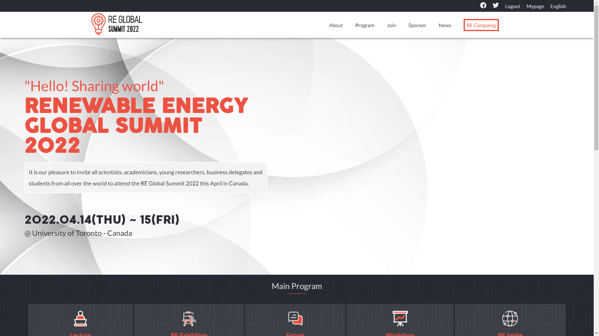

# RE Global Summit 2022

> This is the first capstone project from Microverse course. This capstone is about recreate [this web page design](https://www.behance.net/gallery/29845175/CC-Global-Summit-2015).

## Built With

- HTML
- CSS
- JavaScript
- Linters

## Live Demo

[Live Demo Link](https://ryxtor.github.io/first-capstone-project/)

## Author

👤 **Lucas Bonnefon**

- GitHub: [@ryxtor](https://github.com/ryxtor)
- Twitter: [@ryxtor](https://twitter.com/ryxtor)
- LinkedIn: [Lucas Bonnefon](https://www.linkedin.com/in/lucas-bonnefon-074a01134/)

## 🤝 Contributing

Contributions, issues, and feature requests are welcome!

Feel free to check the [issues page](https://github.com/ryxtor/first-capstone-project/issues).

## Show your support

Give a ⭐️ if you like this project!

## Acknowledgments

- Original design idea by [Cindy Shin in Behance.](https://www.behance.net/adagio07)

## 📝 License

This project is [MIT](./MIT.md) and [Creative Commons](https://creativecommons.org/licenses/by-nc/4.0/) licensed.